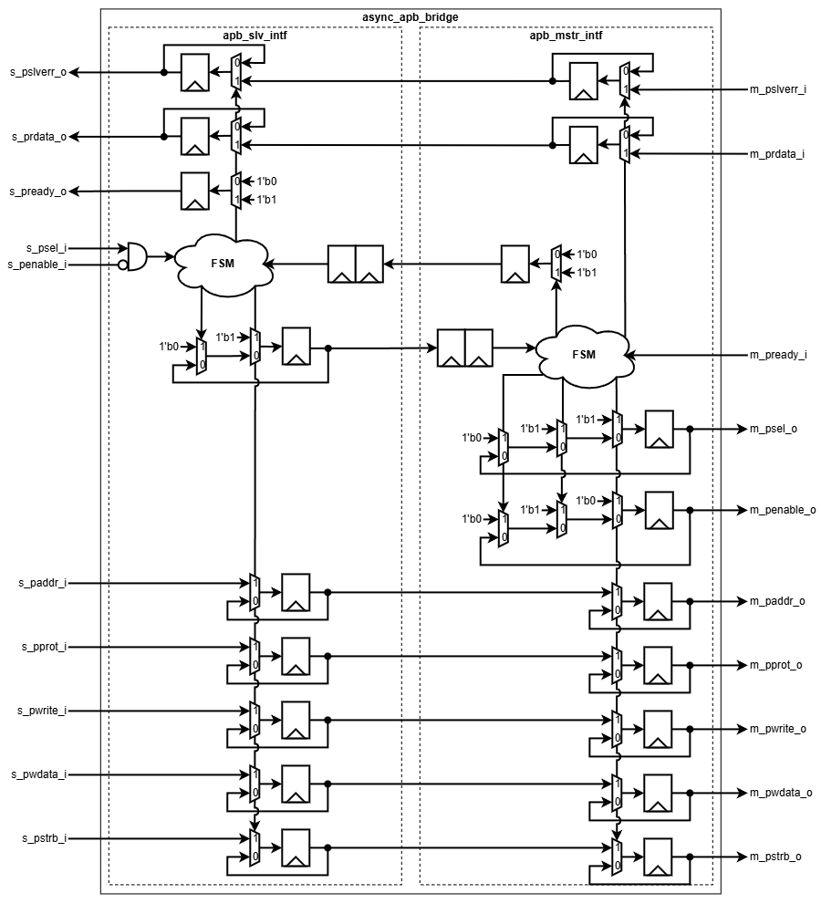

# Asynchronous APB Bridge

> Bridges APB4 transactions between independent master and slave clock domains.

| Item    | Value    |
| ------- | -------- |
| Version | v1.0     |
| Author  | Dat Tran |
| Date    | Oct 2026 |

## 1. Overview

The Asynchronous APB Bridge connects an APB4 slave interface and an APB4 master interface operating in independent clock domains. It transfers APB4 transactions across the clock-domain boundary using a four-phase request/acknowledgment handshake.

### 1.1 Features

* APB4 transaction across independent clock domains
* Four-phase request/acknowledgment handshake
* Configurable address and data widths

# 2. Architecture

### 2.1 Block Diagram

### 2.2 IO Ports

| Port          | Direction | Description                       |
| ------------- | --------- | --------------------------------- |
| `clk_m_i`     | input     | Master clock                      |
| `rst_m_ni`    | input     | Active-low master reset           |
| `clk_s_i`     | input     | Slave clock                       |
| `rst_s_ni`    | input     | Active-low slave reset            |
| `m_paddr_o`   | output    | APB4 master address               |
| `m_pprot_o`   | output    | APB4 master protection attributes |
| `m_psel_o`    | output    | APB4 master select                |
| `m_penable_o` | output    | APB4 master enable                |
| `m_pwrite_o`  | output    | APB4 master write control         |
| `m_pwdata_o`  | output    | APB4 master write data            |
| `m_pstrb_o`   | output    | APB4 master byte strobes          |
| `m_pready_i`  | input     | APB4 master ready                 |
| `m_prdata_i`  | input     | APB4 master read data             |
| `m_pslverr_i` | input     | APB4 master slave error           |
| `s_paddr_i`   | input     | APB4 slave address                |
| `s_pprot_i`   | input     | APB4 slave protection attributes  |
| `s_psel_i`    | input     | APB4 slave select                 |
| `s_penable_i` | input     | APB4 slave enable                 |
| `s_pwrite_i`  | input     | APB4 slave write control          |
| `s_pwdata_i`  | input     | APB4 slave write data             |
| `s_pstrb_i`   | input     | APB4 slave byte strobes           |
| `s_pready_o`  | output    | APB4 slave ready                  |
| `s_prdata_o`  | output    | APB4 slave read data              |
| `s_pslverr_o` | output    | APB4 slave error                  |

### 2.3 Parameters

| Parameter    | Default | Description                                               |
| ------------ | ------: | --------------------------------------------------------- |
| `ADDR_WIDTH` |    `32` | APB4 address width                                        |
| `DATA_WIDTH` |    `32` | APB4 data width; must be byte-aligned and at least 8 bits |

## 3. Functional Description

### 3.1 Write Transaction

The bridge transfers APB4 write transactions from the slave clock domain to the master clock domain, including address, protection, write data, and byte strobes.

### 3.2 Read Transaction

The bridge transfers APB4 read transactions to the master clock domain and returns the read data to the slave clock domain.

### 3.3 Response Transaction

The bridge transfers the downstream PREADY, PRDATA, and PSLVERR results back to the slave clock domain and completes the upstream transaction.

### 3.4 CDC 4 Phase Handshake

The request and response are transferred using a four-phase request/acknowledgment handshake across the clock domains.

### 3.5 Reset

Both master and slave reset signals are guaranteed to assert together. Independent reset assertion is not supported.

## 4. Usage

### 4.1 Integration Guide

Connect the APB4 slave interface to the upstream APB master and the APB4 master interface to the downstream APB slave.

* `clk_s_i` and `clk_m_i` operate in independent clock domains.
* `rst_s_ni` and `rst_m_ni` must assert together.
* Configure `ADDR_WIDTH` and `DATA_WIDTH` according to the connected APB4 interfaces.

### 4.2 Operation Guide

The bridge automatically transfers APB4 transactions between the two clock domains using the four-phase handshake. No additional control or configuration is required during normal operation.

## 5. Verification

| Test                | Status | Description                                         |
|---------------------|--------|-----------------------------------------------------|
| Reset               | PASS   | Reset idle and reset during transaction.            |
| Read / Write        | PASS   | Basic APB4 read and write transactions.             |
| Error response      | PASS   | Verifies `PSLVERR` propagation.                     |
| Wait states         | PASS   | Verifies immediate and delayed `PREADY`.            |
| Data integrity      | PASS   | Verifies address, data, `PSTRB`, and `PPROT`.       |
| Back-to-back        | PASS   | Verifies consecutive APB4 transactions.             |
| Clock configurations| PASS   | Verifies different frequencies, ratios, and phases. |
| Random              | PASS   | Verifies randomized APB4 transactions.              |
| CDC handshake       | PASS   | Verifies four-phase request/acknowledgment.         |    

## 6. Synthesis

| Item       | Value     |
|------------|-----------|
| Library    | Nangate45 |
| Frequency  | 100MHz    |
| Cell Count | 494       |
| Cell Area  | 1656.382  |
| WNS        | 0.00      |

## 7. Notes

