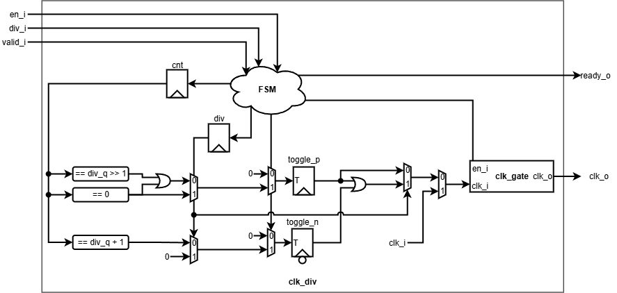

# clk_div

> Configurable clock divider with glitch-free clock gating and runtime reconfiguration.

| Item    | Value    |
| ------- | -------- |
| Version | v1.0     |
| Author  | Dat Tran |
| Date    | Sep 2026 |

## 1. Overview

`clk_div` generates a lower-frequency clock from `clk_i` with runtime enable, division configuration, and glitch-free stopping/reconfiguration.

### 1.1 Features

* Configurable division ratio up to `2^CNT_WIDTH - 1`.
* Runtime clock enable/disable.
* Valid/ready configuration handshake.
* Even and odd division support.
* Bypass for division values `0` and `1`.
* Glitch-free clock stopping and reconfiguration using a clock-gating cell.
* Deterministic clock phase after enable/reconfiguration.

## 2. Architecture

### 2.1 Block Diagram



### 2.2 IO Ports

| Port      | Direction | Description                              |
| --------- | --------- | ---------------------------------------- |
| `clk_i`   | input     | Source clock.                            |
| `rst_ni`  | input     | Active-low asynchronous reset.           |
| `en_i`    | input     | Enables/disables clock generation.       |
| `div_i`   | input     | Requested division value.                |
| `valid_i` | input     | Indicates a valid configuration request. |
| `ready_o` | output    | Indicates that the request is accepted.  |
| `clk_o`   | output    | Generated/gated clock.                   |

### 2.3 Parameters

| Parameter          | Default | Description                                |
| ------------------ | ------: | ------------------------------------------ |
| `CNT_WIDTH`        |       4 | Width of the division counter and `div_i`. |
| `DEFAULT_DIVISION` |       2 | Initial division after reset.              |

The maximum supported division value is:

```text
2^CNT_WIDTH - 1
```

`DEFAULT_DIVISION` must be in the range `1` to `2^CNT_WIDTH - 1`.

## 3. Functional Description

### 3.1 Division

|         `div_i` | Operation                 |
| --------------: | ------------------------- |
|             `0` | Bypass / divide-by-1      |
|             `1` | Bypass / divide-by-1      |
|             `2` | Divide by 2               |
|             `3` | Divide by 3               |
|           `...` | Divide by requested value |
| `2^CNT_WIDTH-1` | Divide by maximum value   |

`div_i = 0` is normalized internally to `1`.

Even divisions use the positive-edge divider state. Odd divisions use both positive- and negative-edge state elements to maintain the intended duty-cycle behavior.

### 3.2 FSM and Clock Control

The FSM contains three states:

* `StIdle`: clock stopped, counter held at zero, configuration can be loaded.
* `StFunc`: normal clock generation.
* `StWait`: completes the current period before stopping or reconfiguring.

`cnt_q == 0` is the defined safe clock boundary. Clock stopping or reconfiguration is performed only at this boundary.

### 3.3 Configuration and Reset

Configuration uses a valid/ready handshake:

```text
valid_i && ready_o
```

The requester must hold `valid_i` and `div_i` stable until the request is accepted.

A changed division value during operation is applied only after the current clock period is safely completed and the clock gate is disabled.

After asynchronous reset:

```text
state_q = StIdle
cnt_q   = 0
div_q   = DEFAULT_DIVISION
clk_o   = 0
```

Illegal parameter values are flagged by assertions during elaboration.

## 4. Usage

### 4.1 Integration Guide

* Connect `clk_i` to the source clock.
* Connect `rst_ni` to the active-low asynchronous reset.
* Use `en_i` to enable or disable clock generation.
* Provide `div_i` through the valid/ready configuration interface.
* Treat `clk_o` as a generated clock in synthesis and timing analysis.
* Implement `clk_gate` using the target technology's clock-gating cell or equivalent clock-aware structure.
* Preserve the clock-generation and gating logic during implementation.

### 4.2 Operation Guide

1. Apply reset; `clk_o` remains low.
2. Provide `div_i` with `valid_i = 1`.
3. Wait for `ready_o` to accept the configuration.
4. Assert `en_i` to start clock generation.
5. To disable, deassert `en_i`; the current period is completed if necessary before stopping.
6. To reconfigure, provide a new `div_i`; the divider safely completes the current period before applying the new configuration.

## 5. Verification

| Test              | Status   | Description                                                                                  |
| ----------------- | -------- | -------------------------------------------------------------------------------------------- |
| Reset             | PASS     | Verifies asynchronous reset and default configuration.                                       |
| Division          | PASS     | Verifies all legal division values, including divide-by-1 bypass.                            |
| Configuration     | PASS     | Verifies valid/ready handshake, unchanged requests, and consecutive requests.                |
| Reconfiguration   | PASS     | Verifies safe transitions between different division values.                                 |
| Enable/Disable    | PASS     | Verifies safe clock start, stop, and restart at different source-clock offsets.              |
| Clock Integrity   | PASS     | Verifies output period, pulse width, startup phase, and optional duty-cycle checks.          |
| Corner Cases      | PASS     | Verifies reset during clock activity, stop/reconfiguration overlap, and boundary conditions. |
| Random Regression | PASS     | Verifies randomized configuration and enable/disable sequences.                              |

## 6. Synthesis

| Item       | Value                  |
| ---------- | ---------------------- |
| Library    | NangateOpenCellLibrary |
| Frequency  | 100MHz                 |
| Cell Count | 143                    |
| Cell Area  | 222.376                |
| WNS        | 0.00                   |

## 7. Notes

* `CNT_WIDTH >= 1`.
* `DEFAULT_DIVISION` must be a legal configuration.
* `div_i = 0` is normalized to `1` and provides divide-by-1 behavior.
* `div_i` must not silently truncate an out-of-range value.
* `clk_gate` must be mapped to a technology-specific clock-gating cell.
* Clock-generation logic is implementation-sensitive and should be preserved during synthesis/implementation.
* Appropriate generated-clock constraints are required for timing analysis.

