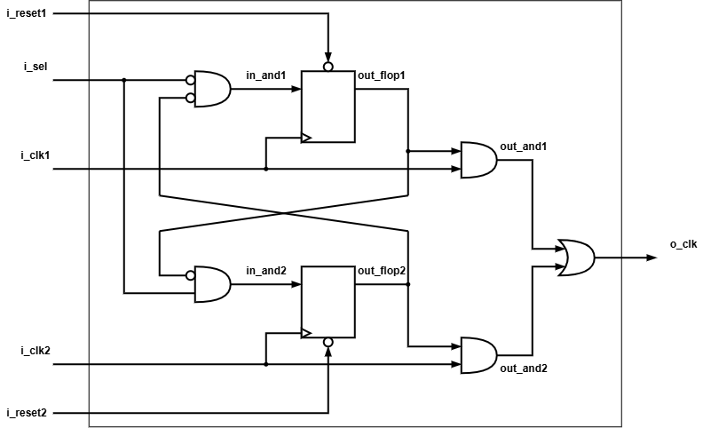

# clk_mux

> Glitch-free clock multiplexer with dual independent asynchronous resets.

| Item | Value |
|---|---|
| Version | 1.0 |
| Author | Huy Nguyen |
| Date | September 13, 2026 |

## 1. Overview

The `clk_mux` is a highly reliable, glitch-free clock multiplexer designed to safely switch between two asynchronous clock domains. By utilizing a cross-coupled feedback topology, it guarantees that the output clock remains clean and free of spurious edges (glitches) even when the clock select signal toggles randomly or when the clock domains operate at entirely different frequencies.

### 1.1 Features

- **Glitch-Free Switching:** Ensures safe transitions between two asynchronous clock sources without generating runt pulses or glitches on the output.
- **Dual Independent Resets:** Features dedicated active-low asynchronous resets for each clock domain, supporting staggered and independent reset sequencing.
- **Fully Asynchronous Support:** Safely handles clock sources with vastly different periods and phases.

## 2. Architecture

### 2.1 Block Diagram

### 2.2 IO Ports

| Port | Direction | Description |
|---|---|---|
| `i_reset1` | input | Active-low asynchronous reset for clock domain 1. |
| `i_reset2` | input | Active-low asynchronous reset for clock domain 2. |
| `i_clk1` | input | Source clock 1. |
| `i_clk2` | input | Source clock 2. |
| `i_sel` | input | Clock selection signal (0 selects `i_clk1`, 1 selects `i_clk2`). |
| `o_clk` | output | Multiplexed glitch-free output clock. |

### 2.3 Parameters

| Parameter | Default | Description |
|---|---:|---|
| N/A | N/A | This module does not require compile-time parameters. |

## 3. Functional Description

### 3.1 Cross-Coupled Feedback (Glitch Prevention)

The core mechanism of the `clk_mux` relies on the combinational logic signals `in_and1` and `in_and2`. The selection of a new clock is gated by the inverted state of the previously active clock's synchronization flop (`!out_flop2` or `!out_flop1`). This interdependent feedback loop mathematically guarantees that one clock path is entirely disabled and flushed before the new clock path is allowed to propagate to the output OR-gate.

### 3.2 Clock Selection Behavior

- When `i_sel = 0`: The `i_clk2` path is disabled. `out_flop1` samples a high state, allowing `i_clk1` to pass through `out_and1` to `o_clk`.
- When `i_sel = 1`: The `i_clk1` path is disabled. `out_flop2` samples a high state, allowing `i_clk2` to pass through `out_and2` to `o_clk`.

### 3.3 Independent Domain Resets

The module contains two independent `always` blocks driven by their respective asynchronous resets (`i_reset1` and `i_reset2`). This allows the SoC to safely reset one clock domain while the other is actively transmitting to `o_clk`, which is a common scenario during staggered wake-up sequences across power domains.

## 4. Usage

### 4.1 Integration Guide

- **Clocks:** Connect the two source clocks to `i_clk1` and `i_clk2`. There are no restrictions on the phase or frequency relationship between these two clocks.
- **Resets:** Connect the corresponding active-low reset signals to `i_reset1` and `i_reset2`. Ensure these resets are generated by the reset controller of their respective clock domains.

### 4.2 Operation Guide

To switch clocks during runtime, toggle the `i_sel` pin. The IP automatically handles the safe de-assertion of the current clock, waits for the logic to clear, and seamlessly asserts the new clock. Users do not need to pause or gate the clocks externally before toggling `i_sel`.

## 5. Verification

| Test | Status | Description |
|---|---|---|
| Staggered Reset Release | PASS | Verifies safe initialization when `i_reset1` and `i_reset2` are released at different, non-aligned intervals. |
| Asynchronous Switching | PASS | Verifies glitch-free output when `i_sel` toggles randomly during active clock transitions. |
| Unexpected Domain Reset | PASS | Verifies structural integrity when a reset (e.g., `i_reset1`) is suddenly asserted while the mux is actively outputting the other domain (`i_clk2`). |

## 6. Synthesis

| Item | Value |
|---|---|
| Library | TBD |
| Frequency | 100 MHz (`i_clk1`) / 62.5 MHz (`i_clk2`) |
| Cell Count | TBD |
| Cell Area | TBD |
| WNS | TBD |

## 7. Notes

**Critical STA Constraints (SDC):** 
When running Synthesis or Static Timing Analysis (STA) on this IP, you must strictly define the clock groups to prevent false violations caused by the cross-coupled feedback paths.
1. **Input Clocks:** `i_clk1` and `i_clk2` must be defined as `-asynchronous` clock groups.
2. **Output Clocks:** Two generated clocks should be created on the `o_clk` port (e.g., `o_clk1` and `o_clk2`). These must be defined as `-physically_exclusive` clock groups since they cannot physically exist on the wire simultaneously.
3. **Selection Pin:** Ensure `i_sel` is properly constrained with input delays relative to **both** input clocks, or set as a false path if toggled statically by a configuration register.
