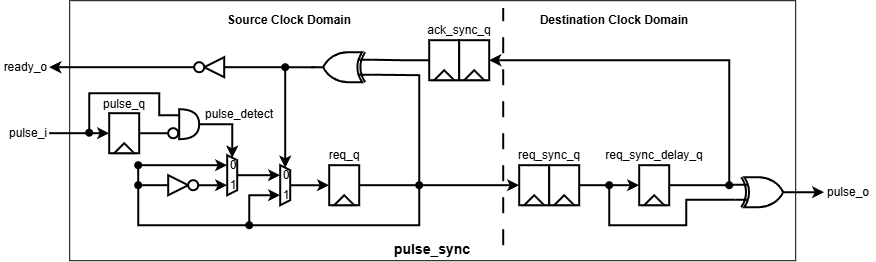

# pulse_sync

> Pulse synchronizer for transferring pulse events between asynchronous clock domains using a 2-phase toggle handshake.

| Item    | Value      |
| ------- | ---------- |
| Version | 1.0        |
| Author  | Dat Tran   |
| Date    | Sep 2026   |

## 1. Overview

`pulse_sync` transfers pulse events from a source clock domain to a destination clock domain using a 2-phase toggle handshake.

### 1.1 Features

* Safe pulse transfer between asynchronous clock domains.
* 2-phase toggle handshake mechanism.
* `ready_o` indicates when a new pulse can be accepted.
* Supports arbitrary source/destination clock ratios.

## 2. Architecture

### 2.1 Block Diagram



### 2.2 IO Ports

| Port         | Direction | Description                                                |
| ------------ | --------- | ---------------------------------------------------------- |
| `clk_src_i`  | input     | Source clock.                                              |
| `rst_src_ni` | input     | Active-low asynchronous source reset.                      |
| `pulse_i`    | input     | Input pulse signal in the source clock domain.             |
| `ready_o`    | output    | High when the synchronizer can accept a new pulse.         |
| `clk_dst_i`  | input     | Destination clock.                                         |
| `rst_dst_ni` | input     | Active-low asynchronous destination reset.                 |
| `pulse_o`    | output    | One-cycle pulse generated in the destination clock domain. |

### 2.3 Parameters

This IP has no configurable parameters.

## 3. Functional Description

### 3.1 Pulse Transfer

A rising edge on `pulse_i` is detected in the source clock domain.

When the synchronizer is idle (`ready_o = 1`), the request toggle `req_q` changes state. The toggle is synchronized into the destination clock domain using a two-stage synchronizer.

The destination detects the toggle transition and generates `pulse_o` for one destination clock cycle.

### 3.2 Handshake and Ready

The source considers the transfer complete when the synchronized request state returns to the same value as `req_q`.

```text
ready_o = !(req_q ^ ack_sync_q)
```

When `ready_o = 0`, the previous pulse is still being transferred and a new pulse must not be accepted.

Once the destination has detected the request and the corresponding state has propagated back to the source domain, `ready_o` returns high.

### 3.3 Reset

Both source and destination domains use active-low asynchronous reset.

During reset:

* `req_q` is cleared.
* Source pulse history is cleared.
* Destination request history is cleared.
* Synchronizer stages are cleared.
* `pulse_o` remains inactive.
* `ready_o` becomes high after the source-side reset state is established.

Both clock domains are expected to use their corresponding resets during initialization.

## 4. Usage

### 4.1 Integration Guide

Connect the IP as follows:

* `clk_src_i` to the source clock.
* `rst_src_ni` to the source-domain reset.
* `pulse_i` to the source-domain pulse signal.
* `clk_dst_i` to the destination clock.
* `rst_dst_ni` to the destination-domain reset.
* `pulse_o` to the destination-domain logic.
* Use `ready_o` to determine whether a new pulse can be accepted.

The source must wait for `ready_o = 1` before issuing another pulse event.

The source and destination clocks may have different frequencies and phases.

### 4.2 Operation Guide

Normal operation:

1. Wait until `ready_o = 1`.
2. Assert `pulse_i` for a source-clock cycle.
3. The request toggle changes state.
4. The request propagates through the destination synchronizer.
5. `pulse_o` is generated for one destination-clock cycle.
6. The handshake completes and `ready_o` returns high.
7. The next pulse can then be accepted.

If `pulse_i` occurs while `ready_o = 0`, it must not be treated as a new transferable event.

## 5. Verification

| Test                 | Status | Description                                                          |
| -------------------- | ------ | -------------------------------------------------------------------- |
| TC01 Reset           | PASS   | Verifies reset behavior and initial state.                           |
| TC02 Single pulse    | PASS   | Verifies transfer of a single pulse.                                 |
| TC03 Multiple pulses | PASS   | Verifies multiple pulse transfers.                                   |
| TC04 Busy            | PASS   | Verifies behavior while a transfer is in progress.                   |
| TC05 Back-to-back    | PASS   | Verifies consecutive pulse transactions with handshake.              |
| TC06 Clock ratios    | PASS   | Verifies operation across different source/destination clock ratios. |
| TC07 Pulse width     | PASS   | Verifies different input pulse widths.                               |
| TC08 Random stress   | PASS   | Randomized stress test of pulse transfer and handshake.              |

**Total: 251 checks, 0 failures — PASS**

## 6. Synthesis

| Item            |     Value |
| --------------- |  -------: |
| Library         | Nangate45 |
| Frequency       |   100 MHz |
| Cell Count      |        11 |
| Cell Area       |    44.422 |
| Sequential Area |    37.240 |
| WNS             |   0.00 ns |

## 7. Notes

* The source and destination clocks are asynchronous.
* The CDC request path uses a 2-stage synchronizer.
* `ready_o` provides source-side back-pressure and prevents a new transfer while the previous request is outstanding.
* A pulse event is represented internally as a toggle, so the destination does not depend on the input pulse width.
* The testbench verifies clock-ratio variations, pulse widths, busy conditions, back-to-back transfers, and randomized traffic.
* Both clock domains should be brought out of reset consistently during normal integration.

