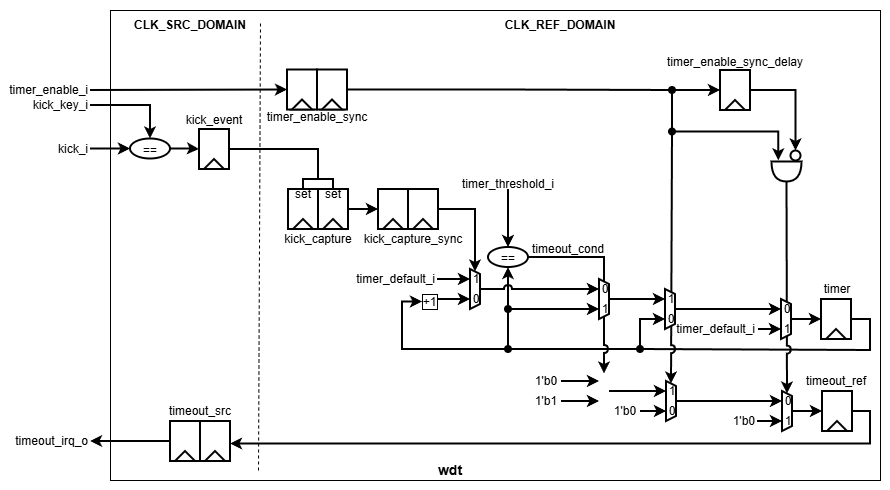

# wdt

> Watchdog Timer for monitoring system operation and detecting timeout conditions.

| Item    | Value     |
| ------- | --------- |
| Version | v1.0      |
| Author  | Dat Tran  |
| Date    | 2026 Sept |

## 1. Overview

The Watchdog Timer (WDT) monitors system operation using a configurable timer. The timer starts from a programmable default value, counts toward a programmable timeout threshold, and can be reloaded by a valid kick event. When the timeout condition is reached, the timeout interrupt remains asserted until the timer is disabled or reset.

### 1.1 Features

* Configurable timer width and kick-key width.
* Programmable default timer value and timeout threshold.
* Enable-controlled timer operation with reload on enable.
* Key-based watchdog kick mechanism.
* Kick synchronization from the source clock domain to the reference clock domain.
* Timeout interrupt synchronization from the reference clock domain to the source clock domain.
* Sticky timeout behavior until watchdog disable or reset.
* Timeout has priority over kick when both occur at the timeout condition.
* Timer remains idle while disabled to reduce unnecessary switching activity.

## 2. Architecture

### 2.1 Block Diagram

### 2.2 IO Ports

| Port                | Direction | Description                                                                                  |
| ------------------- | --------- | -------------------------------------------------------------------------------------------- |
| `timer_default_i`   | input     | Default timer value loaded when the watchdog is enabled or successfully kicked.              |
| `timer_threshold_i` | input     | Timer value at which the timeout condition is generated.                                     |
| `timer_enable_i`    | input     | Enables watchdog operation. The rising edge is used to start and reload the timer.           |
| `kick_key_i`        | input     | Expected key value for a valid watchdog kick.                                                |
| `clk_src_i`         | input     | Source clock domain clock.                                                                   |
| `rst_src_ni`        | input     | Active-low asynchronous reset for the source clock domain.                                   |
| `kick_i`            | input     | Watchdog kick key received in the source clock domain.                                       |
| `timeout_irq_o`     | output    | Timeout interrupt generated from the synchronized timeout status in the source clock domain. |
| `clk_ref_i`         | input     | Reference clock used for watchdog timer operation.                                           |
| `rst_ref_ni`        | input     | Active-low asynchronous reset for the reference clock domain.                                |

### 2.3 Parameters

| Parameter     | Default | Description                                                 |
| ------------- | ------: | ----------------------------------------------------------- |
| `TIMER_WIDTH` |      16 | Width of the watchdog timer and timer configuration values. |
| `KICK_WIDTH`  |       8 | Width of the watchdog kick key and kick input.              |

## 3. Functional Description

### 3.1 Timer Operation

The watchdog timer operates in the reference clock domain.

When `timer_enable_i` is asserted, the synchronized enable signal is detected and the timer is loaded with `timer_default_i`. After the initial reload, the timer increments on each reference clock cycle while the watchdog remains enabled.

When the watchdog is disabled, the timer stops updating. This keeps the timer state stable and avoids unnecessary switching activity while the watchdog is inactive.

### 3.2 Kick Operation

A watchdog kick is generated when `kick_i` matches `kick_key_i` in the source clock domain.

The kick event is captured and synchronized into the reference clock domain. When a valid synchronized kick is received during watchdog operation, the timer is reloaded with `timer_default_i`.

A kick received while the watchdog is disabled has no effect on the timer operation.

### 3.3 Timeout Operation

The timeout condition is asserted when the timer reaches `timer_threshold_i` while the watchdog is enabled.

Once the timeout condition is reached, the timer stops counting and `timeout_ref` is asserted. The timeout status remains asserted until the watchdog is disabled or the reference-domain reset is asserted.

The timeout status is synchronized from the reference clock domain to the source clock domain and is provided through `timeout_irq_o`.

When a timeout condition and a valid kick occur at the same time, the timeout condition has priority and the timer is not reloaded.

The enable signal is synchronized into the reference clock domain. Its rising edge is used to start a new watchdog operation and reload the timer from `timer_default_i`.

Reset behavior:

* `rst_ref_ni` resets the reference-domain timer, enable state tracking, and timeout status.
* `rst_src_ni` resets the source-domain kick event and synchronized timeout output.
* Configuration inputs are not internally stored and are expected to remain valid during watchdog operation.

## 4. Usage

### 4.1 Integration Guide

Connect the watchdog to the source and reference clock domains as follows:

* Connect `clk_src_i` to the source clock domain.
* Connect `rst_src_ni` to the active-low asynchronous source-domain reset.
* Connect `clk_ref_i` to the reference clock domain.
* Connect `rst_ref_ni` to the active-low asynchronous reference-domain reset.
* Configure `timer_default_i` with the value to which the timer is loaded at watchdog start and after a valid kick.
* Configure `timer_threshold_i` with the timeout threshold.
* Configure `kick_key_i` with the expected kick key.
* Assert `timer_enable_i` to start watchdog operation.
* Provide `kick_i` from the source clock domain when the watchdog needs to be serviced.
* Monitor `timeout_irq_o` in the source clock domain.

The configuration inputs should remain stable while the watchdog is enabled. `timer_enable_i` is intended to be asserted after the other watchdog configuration values have been established.

### 4.2 Operation Guide

The normal operating sequence is:

1. Configure `timer_default_i`.
2. Configure `timer_threshold_i`.
3. Configure `kick_key_i`.
4. Assert `timer_enable_i`.
5. The enable signal is synchronized to the reference clock domain.
6. The timer loads `timer_default_i` on the enable rising edge.
7. The timer increments on each reference clock cycle.
8. Provide a valid `kick_i` when the watchdog needs to be serviced.
9. A valid kick reloads the timer with `timer_default_i`.
10. If the timer reaches `timer_threshold_i`, the timeout status is asserted.
11. Once asserted, the timeout interrupt remains active until the watchdog is disabled or reset.
12. Deassert `timer_enable_i` to clear the timeout condition and stop the timer.

The watchdog must be configured before enabling it. Configuration changes during active watchdog operation should be avoided unless the system-level integration explicitly guarantees the required behavior.

## 5. Verification

| Test                                 | Status | Description                                                         |
| ------------------------------------ | ------ | ------------------------------------------------------------------- |
| `tc01_reset`                         | PASS   | Verifies watchdog reset behavior.                                   |
| `tc02_enable`                        | PASS   | Verifies watchdog enable and timer initialization.                  |
| `tc03_disabled_state`                | PASS   | Verifies timer behavior while watchdog is disabled.                 |
| `tc04_timer_counting`                | PASS   | Verifies normal timer counting.                                     |
| `tc05_kick_reload`                   | PASS   | Verifies timer reload after a valid kick.                           |
| `tc06_invalid_kick`                  | PASS   | Verifies that an invalid kick does not reload the timer.            |
| `tc07_kick_between_samples`          | PASS   | Verifies kick behavior between reference-clock samples.             |
| `tc08_kick_assert_deassert`          | PASS   | Verifies kick assertion and deassertion behavior.                   |
| `tc09_kick_held_active`              | PASS   | Verifies behavior when the kick remains continuously asserted.      |
| `tc10_timeout`                       | PASS   | Verifies timeout generation.                                        |
| `tc11_timeout_persistence`           | PASS   | Verifies that timeout remains asserted after timeout occurs.        |
| `tc12_timeout_priority_over_kick`    | PASS   | Verifies timeout priority when timeout and kick occur together.     |
| `tc13_timeout_clear_by_disable`      | PASS   | Verifies timeout clearing when watchdog is disabled.                |
| `tc14_restart_after_timeout`         | PASS   | Verifies watchdog restart after a timeout.                          |
| `tc15_enable_disable_transition`     | PASS   | Verifies enable and disable transitions.                            |
| `tc16_clock_ratio`                   | PASS   | Verifies operation with different source and reference clock rates. |
| `tc17_reset_during_normal_operation` | PASS   | Verifies reset during normal watchdog operation.                    |
| `tc18_reset_during_timeout`          | PASS   | Verifies reset behavior while timeout is active.                    |
| `tc19_random_test`                   | PASS   | Verifies IP under random stress test with different clock ratio.    |

## 6. Synthesis

| Item       | Value                                     |
| ---------- | ----------------------------------------- |
| Library    | Nangate45                                 |
| Frequency  | `clk_src_i`: 100 MHz; `clk_ref_i`: 10 MHz |
| Cell Count | 165                                       |
| Cell Area  | 355.90                                    |
| WNS        | 0.00                                      |

## 7. Notes

* Configuration inputs `timer_default_i`, `timer_threshold_i`, and `kick_key_i` should remain stable while the watchdog is enabled.
* `timer_enable_i` should be asserted only after the watchdog configuration values have been established.
* `clk_src_i` and `clk_ref_i` are independent clock domains. Kick and timeout status are transferred between the two domains through synchronizers.
* The watchdog configuration should be selected such that the timer default value and timeout threshold provide the intended timeout interval.

